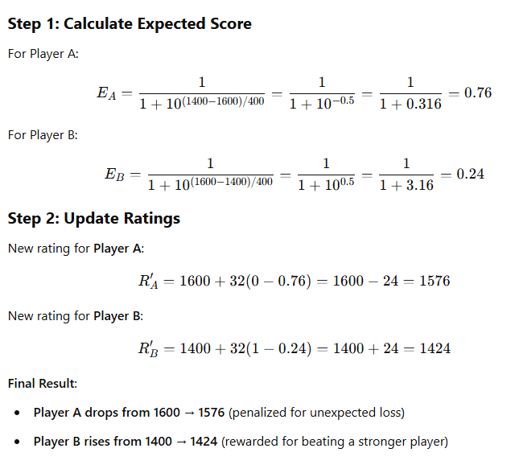

How the Elo Rating System Works
The Elo rating system is a mathematical model used to rank competitors based on their performance. It dynamically adjusts a player's (or entity’s) rating after each match based on expected versus actual outcomes.

1. The Core Concept
   Each competitor (e.g., a restaurant, chess player, esports team) has a rating. The system updates ratings after every competition based on the following principles:

If a higher-rated competitor wins, their rating increases slightly.
If a lower-rated competitor wins, their rating increases significantly.
If an underdog beats a favorite, the system penalizes the favorite more than usual.
If the match ends in a draw, the lower-rated competitor gains points while the higher-rated one loses a few.

2. The Elo Formula

After a match, the new rating is calculated as:

R′=R+K(S−E)

Where:
R′= New rating

R = Current rating

K = K-factor (adjustment factor, usually between 10 and 40, depending on sensitivity)

S = Actual score (1 = win, 0.5 = draw, 0 = loss)

E = Expected score (probability of winning based on current ratings)

3. Calculating the Expected Score
   The expected probability of winning is determined using:

E= 1 / 1+10 (R opponent −R player )/400

Where:

R player = Your rating

R opponent = Opponent’s rating

400 = Scaling factor (adjusts impact of rating difference)

4.  Example Calculation

Scenario: Chess Match

Player A (Rating: 1600) vs. Player B (Rating: 1400)

K-factor: 32 (moderate sensitivity)

Outcome: Player B wins (S = 1 for Player B, 0 for Player A)

Final Result:

Player A drops from 1600 → 1576 (penalized for unexpected loss)
Player B rises from 1400 → 1424 (rewarded for beating a stronger player)

5. Elo in Different Applications

   The Elo system is widely used beyond chess:

Esports (e.g., League of Legends, CS:GO, FIFA, Dota 2)
Poker & Sports Betting
Corporate Performance (employee evaluations, stock market analysis)
Restaurant Ranking Systems (customer choices impact rankings dynamically)

6. Key Takeaways
   ✅ Elo is dynamic – Ratings change based on real-world performance.
   ✅ Fair & self-correcting – Unexpected upsets impact rankings significantly.
   ✅ More accurate than fixed review systems – Adjusts based on head-to-head performance rather than static averages.

What are we ranking
-AI
-Hotels

AI - criteria -> accuracy, speed, quality

What Kind of Input are we looking for ?
and how we can use it

we tryna make it universal

AI models -

The Problem
-Rank AI models according to different applications - e.g which one can write better emails with less prompts (correctness , )
